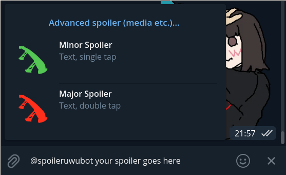
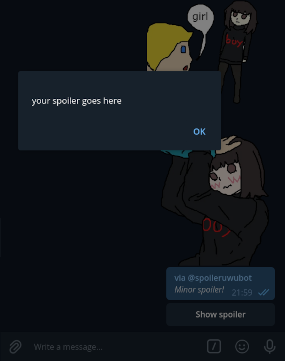

# spoilerowobot

A Rust rewrite of the [Spoilerobot](https://github.com/39bit/spoilerobot), a Telegram spoiler creation bot.

## Install

- Message [@BotFather](https://t.me/botfather) on Telegram to acquire a new bot token
- `export` the token as `SPOILEROWO_BOT_TOKEN` environment variable
- `cargo install spoilerowobot`
- Run the bot and have fun ^-^

## Usage
### Inline
Open any chat on Telegram. Start typing `@spoilerowobot Your spoiler message` (or whatever username you choose
for your bot).

### Advanced
To create an advanced spoiler hit the `Advanced spoiler…` button or open a PM with your bot and
type `/start`. The bot will guide you through the process.

Type `/help` to get additional usage information.